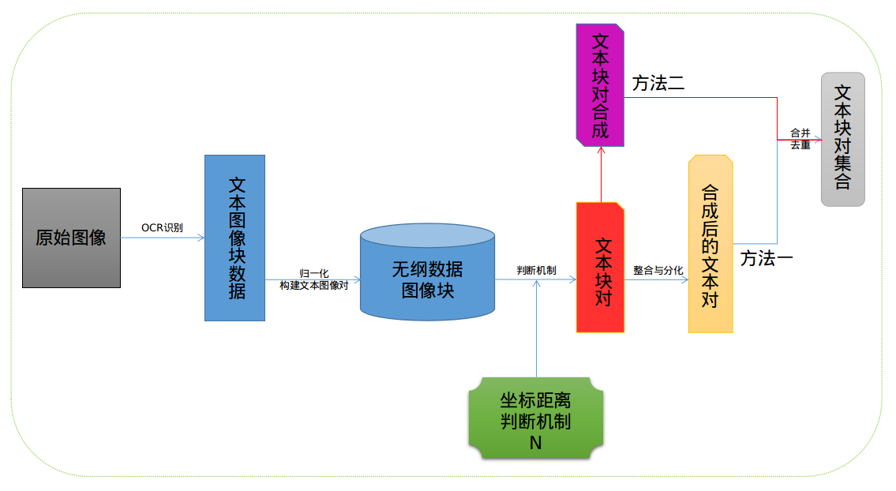
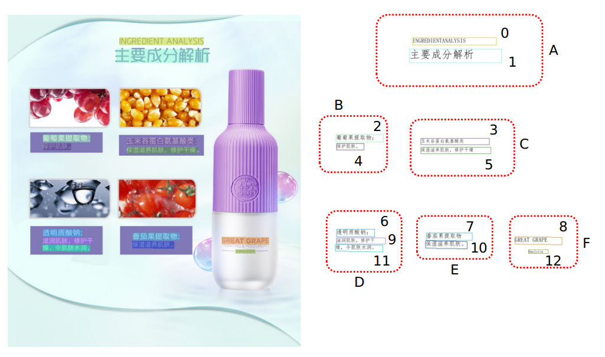

# 联合利华宣称工具技术方案


## 一、概要

构建文本块图像的集合，实质就是在图像中判断哪些文本块能够合成一个整体，哪些文本块不能进行组合。我们先提取出图像中的文本，再对其在几何位置及逻辑上进行组合，最后再使用NLP模型对组合的文本几何进行判断，从而输出组合成功的文本块集合。

对图像进行OCR识别，识别出图像中各个文本块的内容、坐标点、文本的置信度、文本块的序号（自左向右、自上向下）。 		

对图片中的所有文本图像块进行一对一的匹配，计算文本块与文本块之间的距离。找出最能分离文本块簇、又能合并文本块对的距离，即是所确定的分离文本块距离。

方法一：能组合的文本块对，结合文板块的坐标信息，生成三个的文本块集合。

方法二：能组合的文本块对，根据合集并集合成大的集合（链），即文本块簇。在文本块簇中，根据文本块的连续性、可读性规则，选择出至多三个文本块的子集。

将方法一、方法二中的文本块集合进行合并去重，即是所能合成的文本块。


## 二、**技术实施方案**




### 1.OCR识别

图像的OCR识别，使用PaddleOCR中的模型，文本检测模型是ch_ppocr_server_v2.0_det，文本识别模型是ch_ppocr_server_v2.0_rec，方向调整模型是ch_ppocr_mobile_v2.0_cls。

识别图像数据，输出数据，输出的数据结构如下

```
-image_name,str,图像的名字
-image_size,list,图像的宽与高
-text_boxes,list<object>,图像中的文本块信息
	-box_position,list,文本块的四个角的坐标;顺时针方向
	-box_text,str,文本块的内容
	-box_text_confidence,float,识别此文本块的置信度
	-box_id,int,文本块的序号
	-box_w_h,list,文本块的宽与高
```


### 2.文本块合成

#### 2.1.数据归一化、构建文本对

**归一化**

标记好的数据，先过滤异常文本块，再经过归一化后，得到所需要的文本块数据。

对图像中文本块部分的归一化，主要是对其坐标进行，消除横向、纵向上的纲量影响。

文本块的中心是找出几何图像中的质心。

图像中的一个文本块的数据结果如下

```
-image_name,str,图像的名字
-image_size,list,图像的宽与高
-text_boxes,list<object>,图像中的文本块信息
	-box_position,list,文本块的四个角的坐标;顺时针方向
	-box_text,str,文本块的内容
	-box_text_confidence,float,识别此文本块的置信度
	-box_id,int,文本块的序号
-box_w_h,list,文本块的宽与高
-box_data_pro,list,文本块处理后的数据
```

其中box_data_pro的数据是

```
	[x1,y2,x2,y2,x3,y3,x4,y4,w,h,x,y]
	x1,y2,x2,y2,x3,y3,x4,y4是文本图像块中左上、右上、右下、左下的坐标。
	w，h是其文本图像块的宽与高。
	x，y是文本图像块的中心。
```


**构建文本对**

对单张图片中的所有文本块进行组合，两两进行匹配，输出所有的文本对。

```
-image_name,str,图像的名字
-image_size,list,图像的宽与高
-text_boxes,list<list>,图像中的文本块信息
	-list<object>, 这里的每一个list都有两个object
        -box_position,list,文本块的四个角的坐标;顺时针方向
        -box_text,str,文本块的内容
        -box_text_confidence,float,识别此文本块的置信度
        -box_id,int,文本块的序号
        -box_w_h,list,文本块的宽与高
        -box_data_pro,list,文本块处理后的数据
```


#### 2.2.坐标距离判断机制N

对归一化的图片进行分析，我们知道，图片的宽与高都为1，则其对角线是2^(1/2)，即1.414，记为M。

**分析：**对8万张电商的图像进行分析，统计出文本块与文本块之间的距离在[0,0.063]之间，如下图中能合成的文本块，文本块1、文本块0，文本块7、文本块10。文本簇与文本簇之间的距离大于0.063，即下图中A、B、C等文本簇之间的距离。

根据对大量图片中文本的分析知道，文本与文本之间能够连续在一起，能够合并的话，文本之间的距离是相隔很近的，记为距离L。两个或两个以上的文本块能够合成，形成一个大的文本区域（即聚类中所定义的簇），文本区域与文本区域之间的相隔距离，记为H。我们所定义的一个阈值，能够恰当的把文本块与文本块合成，文本区域与文本区域分离，这个阈值记为L0。



如上图所示，我们的目的是找出各个文本块与之距离最相近的文板块，判断这些文本块能合并，如图中的A（0,1）、B（2,4）、C（3,5）、D（6,9,11）、E（7,10,）、F（8,12）。

定义阈值L0，当L0满足：
$$
max(L)< L0<min(H)
$$
我们能较好的分离出各个文本块，相邻的文本能合并，不同区域的文本能分离开。

根据我对大量数据的测试，发现
$$
L0 = 0.0446*M
$$
时，能较好的判断出文本块与文本块能合并。

根据所确定的阈值L0，对图像的文本块对进行判断，从而得出哪些文本块对能进行合成，技术实施方案图中的红色数据。


#### 2.3.方法一

**文本图像块整合**

我们得到能合成的不同的文本块对，再对其进行组合，就形成我们所需要的文本区域（文本簇）。

此时，我们已经得到不同图片里面的不同的文本图像块对，知道哪些能合成为一个整体，哪些不能合成一个整体。

如上述样例中，能合成整体的文本图像块对W有：

```
A（0,1）

B（2,4）

C（3,5）

D（6,9）、（9,11）（6,11）

E（7,10,）

F（8,12）
```

**思路**：*==我们求得图片中有多少个ROI区域，实质可转化为求解文本图像块对集合W中有多少条链表。==*

从集合W中，我们使用集合的并集思想，经过计算，可以得到链A、B、C、D、E、F。

```
A（0,1）

B（2,4）

C（3,5）

D（6,9,11）

E（7,10,）

F（8,12）
```


**文本图像块分化**

我们在各个图像里所合成得到不同的文本图像块集合D（即之前的链表，文本簇）。

根据文本块在图像上的几何特征，进行组合。一个文本簇中，组合的规则如下，

```
1、相邻的文本块两两组合。

2、相隔的文本块两两组合。

3、连续的三个文本块组合。
```


使用上述规则，得到最终的文本组合结果，即技术实施方案图中方法一的输出浅黄色数据。

**步骤如下：**

```
1、设：数据集DE=[A,B,C,D]。

2、数据过滤，过滤只有一个文本图像块的集合。

3、在集合DE中的文本图像块选择文本图像块进行组合，组合规则如下：

    3.1 两个文本块组合；相邻序号的文本块组合（如：A-B、B-C、C-D）
    
    3.2 相隔一个文本块的两个文本块组合（如：A-C、B-D）

    3.3 三个文本块组合；只对其相连的文本块组合（如：A-B-C，B-C-D）

4、最终我们得到的结果是：[A,B]、[B,C]、[C,D]、[A,C]、[B,D]、[A,B,C]、[B,C,D]。
```


#### 2.4.方法二

**文本块对合成**

在方法一中，存在某些文本块的数据进行合成时，会丢失部分相间隔的数据（即本身能合成的数据之间的序号不止一个间隔）。

为避免此类文本块的合成，特补充方法二。

我们对所能合成的数据进行合成，要让文本块具有实际意义，文本块具有连续性、可读性的特征，存在文本块的序号的先后顺序，利用此信息，我们进行整合，规则如下。

**规则**：

```
1、文本块对只能首尾相连的合成，如能合成的文本块对（4,7）、（7,9），即文本块簇(4,7,9)。

2、文本块对只合成一次，即至多有三个文本块组成簇。

3、补充单独不能合成的文本块，即独立的文本块。
```

使用上述规则，我们得到的文本组合结果，即技术实施方案图中方法二的输出紫红色数据。


#### 2.5.合并数据

合并方法一、方法二中的所有文本块组合数据，并进行去重操作，最后得到文本组合结果，即技术实施方案图中最右端的浅灰色文本块对集合数据。


